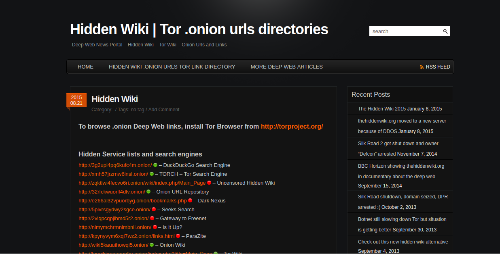
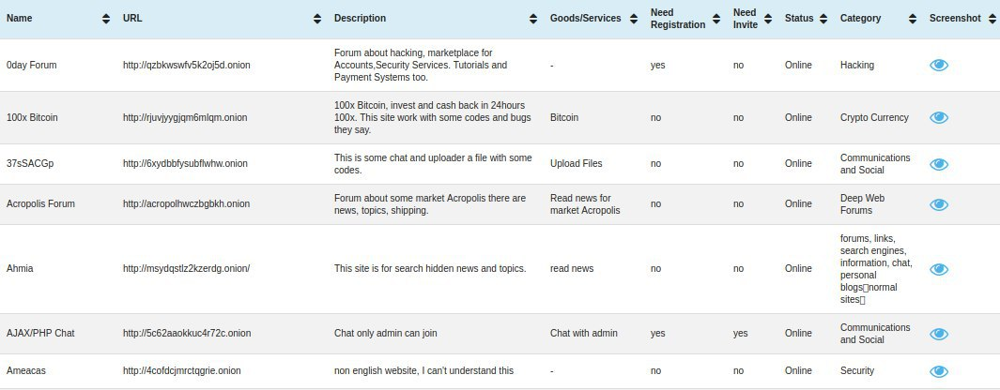
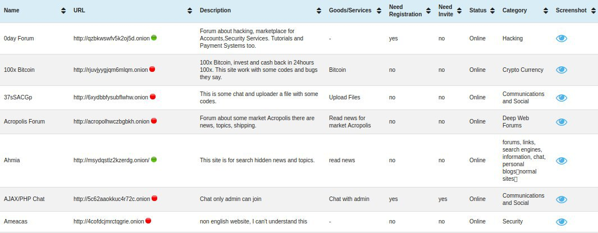

**Authors:** *Simone Raponi, Massimo La Morgia*

**Date:**   *February 20, 2017*

# Onion Gatherer Server

Back-end of https://github.com/rfidlabsapienza/onionGatherer-ChromeExtension

The server was implemented using the Django Framework, associated with a Postgres database.

The addition of the new hidden service addresses in the database is done by a pool of processes that work on a shared queue, this allows better performance and lower waiting times.

The hidden services statuses are evaluated using the curl command via torsocket, a specific socket that allows to use network applications such as ssh and irssi with Tor.

### Summary

  - Install Apache2
  - Install Pip
  - Install Django
  - Install cors-headers module from Django
  - Install psycopg2 module
  - Install socksipy module
  - Install Postgres
  - Modify the configuration file of Postgres
  - Create the database and import the preconfigured scheme
  - Bind Apache2 and Django

Install Apache2
```sh
$ sudo apt-get update
$ sudo apt-get install apache2
```


Install Pip
```sh
$ sudo apt-get install python-pip
```

Install Django
```sh
$ sudo pip install django
```

Install cors-headers module from Django
```sh
$ sudo pip install django-cors-headers
```

Install psycopg2 module
```sh
$ sudo apt-get build-dep python-psycopg2
$ sudo apt-get install psycopg2
```

Install socksipy module
```sh
$ sudo apt-get install python-socksipy
```

Install postgres
```sh
$ sudo apt-get update
$ sudo apt-get install postgresql postgresql-contrib
```

Modify the configuration file **/etc/[your_version_of_postgres]/main/pg_hba.conf** replacing the line: 

> local all postgres peer

with: 

> local all postgres trust

After this change you should restart the postgresql server by typing
```sh
$ sudo service postgresql restart
```

Move in /tmp the database's schema by typing from the project folder 
```sh
$ cp ./oniongatherer.sql /tmp
```

Create the database and import the preconfigured schema
```sh
$ sudo su postgres
$ psql
# CREATE DATABASE oniongatherer;
```

then exit from that shell by typing CTRL + D and type

```sh
$ psql oniongatherer < /tmp/oniongatherer.sql
```

# Bind Apache2 and Django
Open **/etc/apache2/sites-available/000-default.conf**

Inside
```sh
<VirtualHost *:80>

...

<VirtualHost>
```
add

```sh
Alias /static <your_django_project_path>/static
<Directory <your_django_project_path>/static>
    Require all granted
</Directory>

<Directory <your_django_project_path>>
    <Files wsgi.py>
        Require all granted
    </Files>
</Directory>
```

####Figure 1a. thehiddenwiki.org without OnionGatherer Chrome extension

_________________________________________________________________________

####Figure 1b. thehiddenwiki.org with OnionGatherer Chrome extension

_________________________________________________________________________

####Figure 2a. the-hidden-wiki.com without OnionGatherer Chrome extension

_________________________________________________________________________

####Figure 2b. the-hidden-wiki.com with OnionGatherer Chrome extension
